# Capstone Project

#### Machine Learning Engineer Nanodegree

Chenxiang Li

## Predicting Uber Rider Retention

## I. Definition
### Project Overview
Uber is interested in predicting rider retention. It would be very helpful for them to know what factors are most important for rider retention. To help explore this problem, they have provided a sample [dataset](https://www.dropbox.com/s/q5e3lqtma9dwmy6/uber_data_challenge.json?dl=0) of 50,000 users who signed up for an Uber account in January 2014. 

In this binary prediction project, I will apply classification algorithms in Python to predict Uber rider retention and explore feature importance. Eventually, I will provide data-driven suggestions to operationalize those insights to help Uber.

### Problem Statement
I would consider predicting rider retention as a supervised binary classification problem. The ultimate goal of this project is to find an machine learning algorithm to predict current rider retention and optimize retention rate by finding important features.

In this project, I will consider a rider retained if he/she was “active” (i.e. took a trip) in the preceding 30 days. Because the data was pulled several months later, I assumed the current date is `"2014-07-01"` and a user retained if the `last_trip_date` is after `"2014-06-01"`.

- I will complete data cleaning to fill missing values, remove outliers and also preprocess dataset for algorithm implementation.
- In exploratory phase, I will check basic statistics and rider segregation and train a Logistic Regression model as a benchmark.
- As for modeling, I will try Decision Tree, Random Forest and Support Vector Machine (SVM) classifiers to see which performs best on my training set. I will choose one algorithm for further reach to tune the respective parameters. 
- Finally, I will validate my model by cross-validation or on test set. Also, I will check the feature importance in the final model to provide suggestions for Uber.

### Dataset description

* city: city this user signed up in
* phone: primary device for this user
* signup_date: date of account registration; in the form ‘YYYY­MM­DD’
* last_trip_date: the last time this user completed a trip; in the form ‘YYYY­MM­DD’ 
* avg_dist: the average distance *(in miles) per trip taken in the first 30 days after signup 
* avg_rating_by_driver: the rider’s average rating over all of their trips 
* avg_rating_of_driver: the rider’s average rating of their drivers over all of their trips 
* surge_pct: the percent of trips taken with surge multiplier > 1
* avg_surge: The average surge multiplier over all of this user’s trips 
* trips_in_first_30_days: the number of trips this user took in the first 30 days after signing up
* uber_black_user: TRUE if the user took an Uber Black in their first 30 days; FALSE otherwise
* weekday_pct: the percent of the user’s trips occurring during a weekday

### Metrics
As this is a binary classification problem with 50,000 samples, I will use Area Under the Receiver Operating Characteristic curve (AUROC) to measure performance of a model or result in this project. This score tells me the ability of my model to distinguish the two classes. Intuitively, given a random new user, AUROC is the probability that my model can predict correctly on it will be retained or not.

On the other side, AUROC is independent of the fraction of the test population which is class 0 or class 1. This makes AUROC not sensitive to unbalanced dataset. In this case, the retention rate is very likely something far below 50%, so AUROC will work well to evaluate model performance.

*In concept, ROC curve is plot of the true positive rate from confusion matrix VS the false positive rate as the threshold value for classifying an item as 0 or 1 is increased from 0 to 1: if the classifier is very good, the true positive rate will increase very quickly and the area under the curve will be close to 1. If the classifier is no better than random guessing, the true positive rate will increase linearly with the false positive rate and the area under the curve will be around 0.5, which is the probabilty of random guessing.*

_

## II. Analysis
### Data Exploration
The original dataset is in JSON format. It was into Python and easily parsed into a `dataframe` object. It contains 50,000 rows and 12 columns as described above. Each row represents a user behavior. 

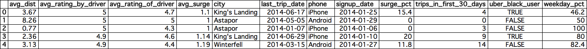

At the first glimpse of the dataset, there are 7 numerical variables, 3 categorical variables and two datetime stamps. 

|           | avg_dist | avg_rating_by_driver | avg_rating_of_driver | avg_surge | surge_pct | trips_in_first_30_days | weekday_pct |
| --------- | -------- | -------------------- | -------------------- | --------- | --------- | ---------------------- | ----------- |
| **count** | 50000    | 49799                | 41878                | 50000     | 50000     | 50000                  | 50000       |
| **mean**  | 5.796827 | 4.778158             | 4.601559             | 1.074764  | 8.849536  | 2.2782                 | 60.926084   |
| **std**   | 5.707357 | 0.446652             | 0.617338             | 0.222336  | 19.958811 | 3.792684               | 37.081503   |
| **min**   | 0        | 1                    | 1                    | 1         | 0         | 0                      | 0           |
| **25%**   | 2.42     | NaN                  | NaN                  | 1         | 0         | 0                      | 33.3        |
| **50%**   | 3.88     | NaN                  | NaN                  | 1         | 0         | 1                      | 66.7        |
| **75%**   | 6.94     | NaN                  | NaN                  | 1.05      | 8.6       | 3                      | 100         |
| **max**   | 160.96   | 5                    | 5                    | 8         | 100       | 125                    | 100         |

Then, I checked basic  statistics for all the 7 numerical variables. There are missing values in `avg_rating_by_driver` and `avg_rating_of_driver`. I also noticed that the *standard deviations* of `surge_pct` and `trips_in_first_30_days` are extremely large with respect to *means*, while other columns may still show abnomalities. I may need to deal with missing values and outliers in these columns.

**Missing value:** After counted missing values in all columns, the good thing is that there exists missing values only in `avg_rating_by_driver`(201), `avg_rating_of_driver`(8122) and `phone`(396). I filled missing values in `avg_rating_by_driver` and `avg_rating_of_driver` with respective `median` values and removed 396 samples with missing value in `phone`. 

**Outlier:** On boxplots of those 7 numerical variables, I confirmed my initial guess from the statistics above. To make it more straightforward, I visualized the data in two separate sets of boxplot on different scales.

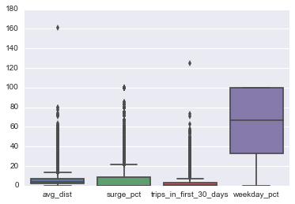 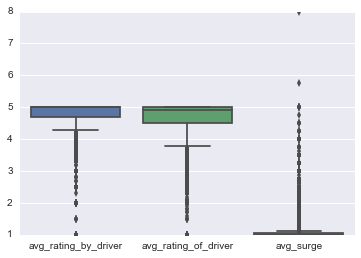

I also counted the outliers out of 1.5×IQR as below. If I drop any sample with an outlier for one column, I may lost more than half the orginal training data. I decided to remove the 7805 samples considered outliers for more than one feature. 
```python
Outliers for 'avg_dist': 4477
Outliers for 'avg_rating_by_driver': 3922
Outliers for 'avg_rating_of_driver': 3106
Outliers for 'avg_surge': 8369
Outliers for 'surge_pct': 6768
Outliers for 'trips_in_first_30_days': 3153
Outliers for 'weekday_pct': 0
```

**Non-numerical variable**: I checked unique values of `city` and `phone` and ranges for `signup_date` and `last_trip_date`. It shows all users are located in three different city: "King's Landing", "Astapor" and "Winterfell" and they all use "iPhone" or "Android" cellphone. As the project background, all the users signed up for an Uber account in January 2014 and took a last trip between 2014-01-01 and 2014-07-01.

**Target variable:** As mentioned before, I assume the current date is "2014-07-01" and a user retained if the `last_trip_date` is after "2014-06-01", which means this user is still considered an "active" user. Therefore, I created a boolean variable `active` as target variable indicating if the user is retained after signed up. Because this target variable was derived from `last_trip_date`, I droped this column.

### Exploratory Visualization

In this section, I will explore the relationships behind the data by some plots. First, I will generate a pair scatter plot to see if there is any multicollinearity or mutual dependencies among the predicting variables.

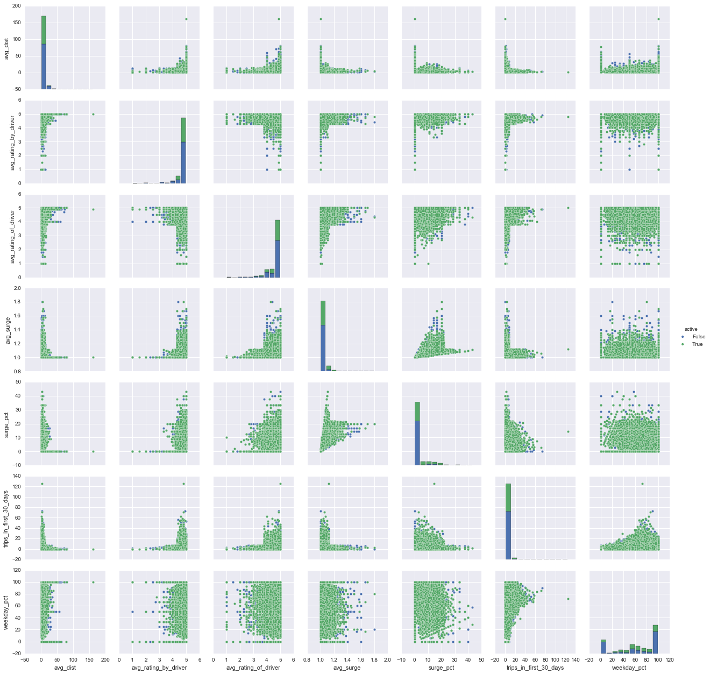

As can be seen from the pair plot above, there must be some correlation between `avg_surge` and `surege_pct`, `avg_rating_of_driver` and `surege_pct`.   A correlation matrix is more straightforward to tell the correlation between variables.

The pair plot also tells me that all these numerical variable don't follow a normal distribution. They are highly skewed. This indicates that the data mostly lies in a narrow range. 

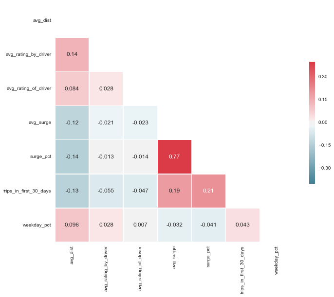

From the correlation matrix above, it shows that `surge_pct` is correlated with `avg_surge`, which might be resulted from a Uber internal surge pricing algorithm. The good thing is that correlated features would not directly affect classification performance. However, considering the Curse of Dimensionality, these two correlated variables may potentially affect classifier performance. In the modeling phase, I may try a non-parametric classifier like **k-Nearest Neighbors (KNN)** into initial comparison.

For categorical variables, I can get a general idea on these three features. On the city plot, it shows that the differences among the retention rates of these three given cities are significant. The city “King’s Landing” might be a new market, which has the smallest amount of users. It owns a very good retention rate. “Astapor” might be similar to “Winterfell”, while it performs a litter worse than “Winterfell”, which might be a relative developed market.

As for `phone` and `uber_black_user`, the plots below show that most Uber rider use "iphone" to request a ride. At the same time, I guess the Uber APP on iPhone probabaly provides a better user experience to lead a user keeping use Uber. Uber black provides definitely a better riding experience. As expected, an Uber black user is more likely to be retained. 

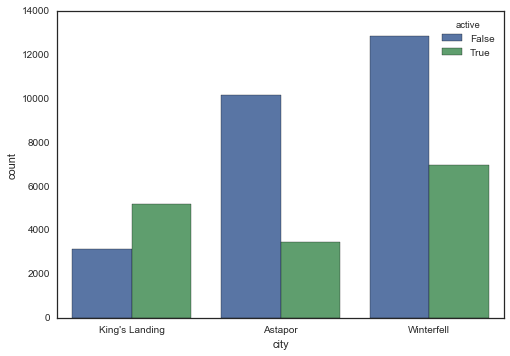 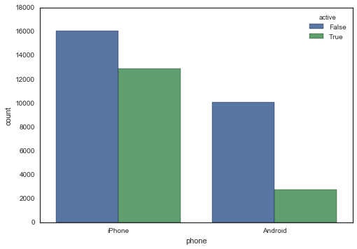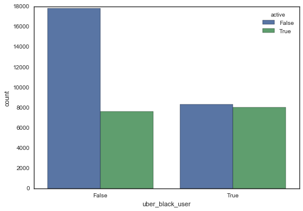

### Algorithms and Techniques
My dataset still has over 40,000 samples for training and validation. After data cleaning, my dataset still suffers two correlated features and high skewed data distributions. 

Apparently, there is not single best algorithm that applied to all kinds of problems. This a binary classification problem with high dimension in including both numerical variables and categorical variables. Assuming the features are roughly linear and the problem is linearly separable, I will train a Logistic Regression model as a benchmark, than try some common machine learning algorithms like k-Nearest Neighbors (KNN), Support Vector Machine (SVM) and Random Forest to choose one for further optimization. The characteristics for this problem are as following:

**Logistic Regression:**

- Pros: Robust to noise, results are interpretable
- Cons: Not good at dealing with categorical variables,

**k-Nearest Neighbors (KNN)**

- Pros: Non-parametric classifier, can deal with correlated variables
- Cons: Average predictive accuracy might be lower

**Support Vector Machine (SVM)** 

- Pros: Don’t suffer multicollinearity
- Cons: Hard to interpret results, might be too slow to apply in a industry scale for Uber

**Random Forest**

- Pros: Performs well on classification problems
- Cons: May overfit for noise

### Benchmark
As starting step, I checked the null error rate, which implies what percentage of total riders retained. It returns **37.405%**, which means that I could obtain **62.595%** accuracy by always predicting "no".

To get a benchmark, I shuffled and split data into training and testing set. Then I trained a Logistic Regression as a benchmark and evaluated by AUROC score. It returned **65.434%**, which means a Logistic Regression model can predict correctly **65.434%** users on if he/she will be retained. So it’s doing a litter bit better than random guess, but not  very much. 

## III. Methodology
### Data Preprocessing
In exploratory analysis phase, I’ve already completed most parts of data cleaning. I dealt with missing values and removed a part of outliers for more than one features. However, to implement machine learning algorithms in `sklearn`, I have to transform the predicting variables to acceptable data types. As most algorithms in `sklearn` don’t accept `object` datatype, I will transform `city`, `phone`,  `signup_date` to `integer` or `float` datatype. The `preprocessing` module in `sklearn` provides a easy way to do this. 
```basic
>>> df.dtypes							
avg_dist                  float64
avg_rating_by_driver      float64
avg_rating_of_driver      float64
avg_surge                 float64
city                       object
phone                      object
signup_date                object
surge_pct                 float64
trips_in_first_30_days      int64
uber_black_user              bool
weekday_pct               float64
active                       bool
dtype: object
```
After encoded the `object` features, the dataframe looks like:
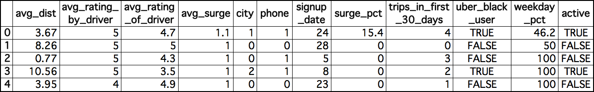

In case of overfitting, I shuffled and split data into training set (70%) and testing set (30%). In the following, I will train algorithms on the training set and validate on the testing set by defined performance metric - AUROC score. 


### Implementation
To get optimal performance, I tried k-Nearest Neighbors (KNN), Support Vector Machine (SVM) and Random Forest algorithms on training set and validated on testing set scored by the defined metric above - AUROC score. The parameters of these three algorithm are set to default and a common random state. First I imported three classifers from respective module in `sklearn`, trained them on the training set and predicted the `active` value on both training set and testing set. 

It returns the following respective performances:

| Algorithm                    | AUROC (Training) | AUROC (Testing) |
| ---------------------------- | ---------------- | --------------- |
| k-Nearest Neighbors (KNN)    | 0.78022775816    | 0.697244988208  |
| Support Vector Machine (SVM) | 0.792745886852   | 0.712026938469  |
| Random Forest                | 0.978383669576   | 0.721167695621  |

From the results above, I can recognize that the `RandomForestClassifier` performs best while it also suffers overfitting. It elevates my model accuracy from the **0.65434** to **0.72117** AUROC on testing set. I’ll choose Random Forest for further optimization.

### Refinement


My initial idea was to tune the `max_features`, `max_depth`, `n_estimators`,  of Random Forest using `grid_search` method. However, it drained out of my Laptop memory. So I decided to keep the `n_estimators` as default, which is 10. Then I tried `grid_search` for following parameter combinations.

-  `max_features`: This is the maximum number of features randomly involved in an individual tree in a Random Forest classifier. By rule of thumb,  the algorithm will take square root of total number of features. Larger `max_features` might improve the model performance. However, this decreases the diversity of individual tree and increase computing power. In this project, I'll try tune `max_features` from 1 to the number of features, which is 11.
-  `max_depth`: As Random Forest is a Tree-based algorithm, `max_depth` limits the depth of an individual tree. Increasing `max_depth` will decrease the number of samples in each node. I'll try to tune it from 1 to 10.
-  `n_estimators`: This is the number of trees in a Random Forest. In practice, the more trees involved in the Random Forest the better performance it gain. However, a larger number of trees may take more computing resource to train. In this case, I won’t optimize it in the `grid_search`, because it will drain out my laptop memory. After got the optimal parameter combination of `max_features` and `max_depth`, I will arbitrarily increase the `n_estimators` from 10 to 100 expecting to get a performance improvement.

```python
parameters =	{
				'max_features': [1,2,3,4,5,6,7,8,9,10,11],
				'max_depth': [1,2,3,4,5,6,7,8,9,10]
#    			'n_estimators': [10,20,30,40,50,60,70,80,90,100] # Too slow to implement
				}
```

In case of overfitting, I set cross validation parameter of the `grid_search` object to 10-fold with 30% sub-testing set and 70% sub-training set. This asks the the `grid_search` object to evaluate each iteration on 30% of the training set. However, I eventually would care about the performance on the testing set.

When the `n_estimators` was set to default, the `grid_search` returned optimal parameters `(‘max_features’=10, 'max_depth’=8)` with 0.7564 AUROC score on testing set and 0.7693 AUROC score on training set. The `grid_search` increased my model performance - AUROC score - from 0.72117 to 0.7564 on testing set.

After I got the best combination of `max_features` and `max_depth`, I arbitrarily set the parameters of `RandomForestClassifier` with `(max_features=10, max_depth=8, n_estimators=100)`. As expected, it slightly further improved AUROC score to 0.7571 on testing set and 0.7713 on training set.

## IV. Results
### Model Evaluation and Validation
In this section, I evaluated the optimal Random Forest classifier obtained from `grid_search`, to validate the robustness of this model. I investigated Random Forest classifier with an increasing `max_features` and `max_depth` on the full training set to observe how model complexity affects training and testing performance.

I referred to the codes for Complexity Curves in my Udacity Project 1. I produced two plots for a Random Forest classifier that has been trained and validated on training data using difference parameter settings. The classifier is scored by AUROC score. 

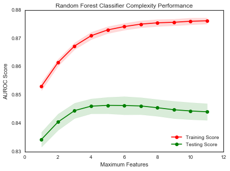  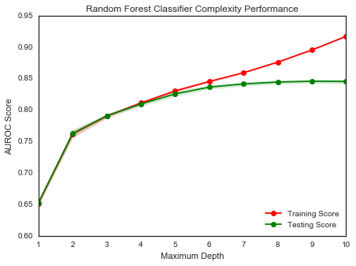

The first plot clearly indicates that the classifier suffers from underfitting to overfitting with high variance along the the increase of `max_features`. That may be caused by the decreasing diversity of individual tree. From the plot, it shows the training curve keeps increase as more features randomly enrolled in a tree, while the testing curve decreases after some point. The shaded band refers that the variance on testing set is higher than on training set. 

On the second plot, it shows the training curve keeps increase as the trees go deeper, while the testing curve tends to stable without much improvement as the trees go deeper. That’s a sign for us to prune trees at some shoulder point.

With these new knowledge, I decided to choose my final Random Forest classifier with parameter settings - `(max_features=4, max_depth=9, n_estimators=100)`. It works still very well with 0.7512 AUROC score on testing set and 0.7734 AUROC score on training set. This could trade off the model complexity and performance. This makes the classifier more easy to implement in a industry scale. 

### Justification
After the optimization above, the Random Forest classifier got 0.7512 AUROC score on testing set. It means this model can predict correctly 75.12% users on if he/she will be retained. It has been improved a lot comparing to a Logistic Regression classifier.

| Actions                    | Algorithm           | AUROC (Training) | AUROC (Testing)     |
| -------------------------- | ------------------- | ---------------- | ------------------- |
| Random guess               | Null error          | 0.62514098       | 0.62783094098883574 |
| Benchmark                  | Logistic Regression | 0.650485459542   | 0.654338556663      |
| Algorithms Comparison      | Random Forest       | 0.978383669576   | 0.721167695621      |
| Parameter Tuning           | Random Forest       | 0.7713           | 0.7571              |
| Trade-off model complexity | Random Forest       | 0.7734           | 0.7512              |

## V. Conclusion
### Reflection
This project built an algorithm to predict a Uber rider is likely to be retained or not. I applied **Logistic Regression** classifier as a starting point and tried **k-Nearest Neighbors (KNN)**, **Support Vector Machine (SVM)** and **Random Forest** classifiers to the training dataset, which was separated from **50,000** samples. I chose **Random Forest* classifier to tune for performance improvement on testing dataset.


Then I tuned two key parameters of **Random Forest** classifier with `grid_search` method. To balance model complexity and model performance, I also analyzed complexity curves. To apply this model in an industry scale in the future, I sacrificed an negligible performance. Finally, the final algorithm could 75.12% correctly predict the user will be retained or not on the testing set, which is 30% of original samples.

In this part, I checked the feature importances contributing to the user retention. It shows that “surge_pct”, ”avg_rating_by_driver”, ”avg_surge”, ”city”, ”weekday_pct”, ”phone” would explain more than 78% on user retention. 

| Rank | Indices | Features               | Importances |
| ---- | ------- | ---------------------- | ----------- |
| 1    | 7       | surge_pct              | 0.193249    |
| 2    | 1       | avg_rating_by_driver   | 0.164058    |
| 3    | 3       | avg_surge              | 0.127574    |
| 4    | 4       | city                   | 0.116354    |
| 5    | 10      | weekday_pct            | 0.111231    |
| 6    | 5       | phone                  | 0.07395     |
| 7    | 8       | trips_in_first_30_days | 0.061989    |
| 8    | 0       | avg_dist               | 0.0503      |
| 9    | 9       | uber_black_user        | 0.048525    |
| 10   | 2       | avg_rating_of_driver   | 0.026413    |
| 11   | 6       | signup_date            | 0.026358    |
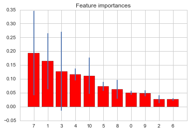

- “surge_pct”, ”avg_surge” and ”weekday_pct”: These three features together indicate that the rigid demand of this user, however, it also reflect their tolerance for a surge price.
- ”avg_rating_by_driver”: This tells us a rider’s response for the ratings by drivers.
- “city”: As for Uber’s business is highly location based, it not strange to see the retentions vary by cities. 
- ”phone”: This confirms my initial hypothesis that iPhone APP provides a better user experiences than Android. And this indirectly affects user retention. Uber development team may conduct further investigation. 


### Improvement
Firstly, as for feature importances, I didn’t perform the feature selection based on importance. If I could remove some nonsignificant features (eg. “signup_date”) in the modeling phase, the algorithm might be more robust to noise and get a better performance. 

Additionally, as I mention in the last section, Uber’s business is hight location related. I would highly recommend to perform this analysis for each city. In that way, this project may provide more valuable insights for Uber.